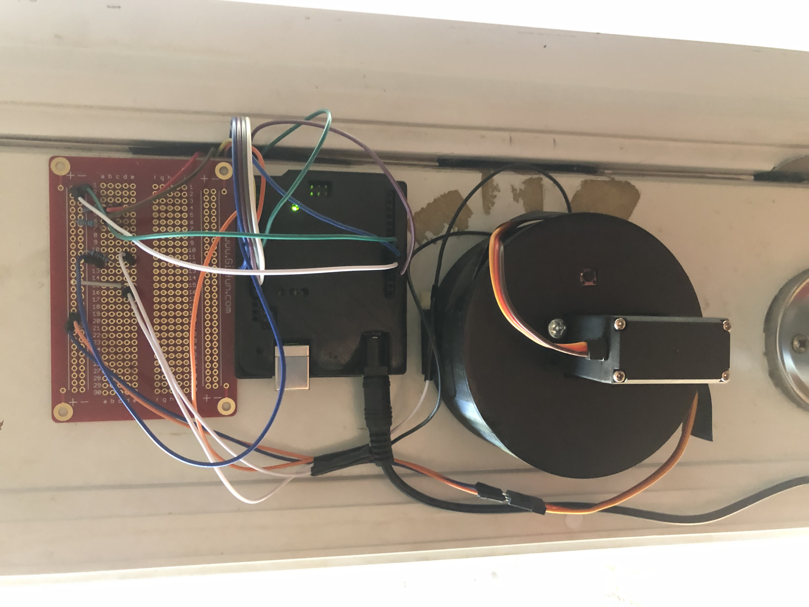
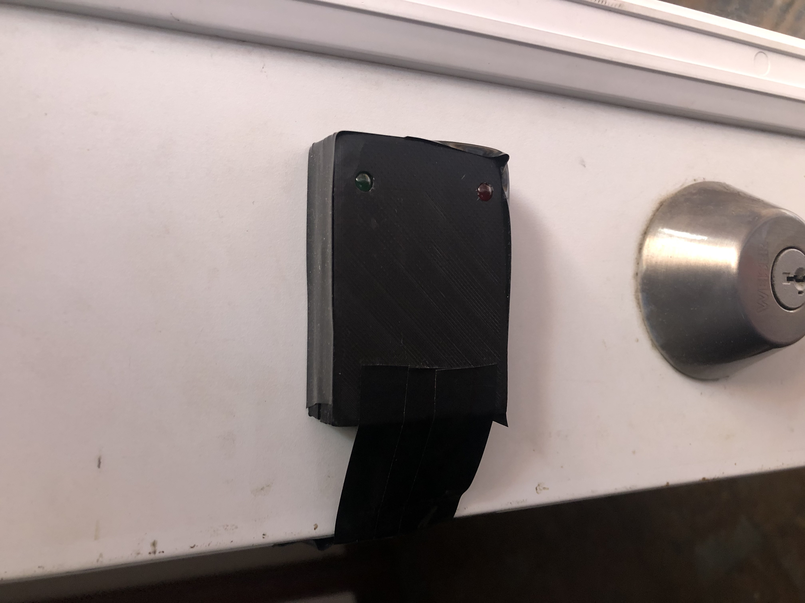
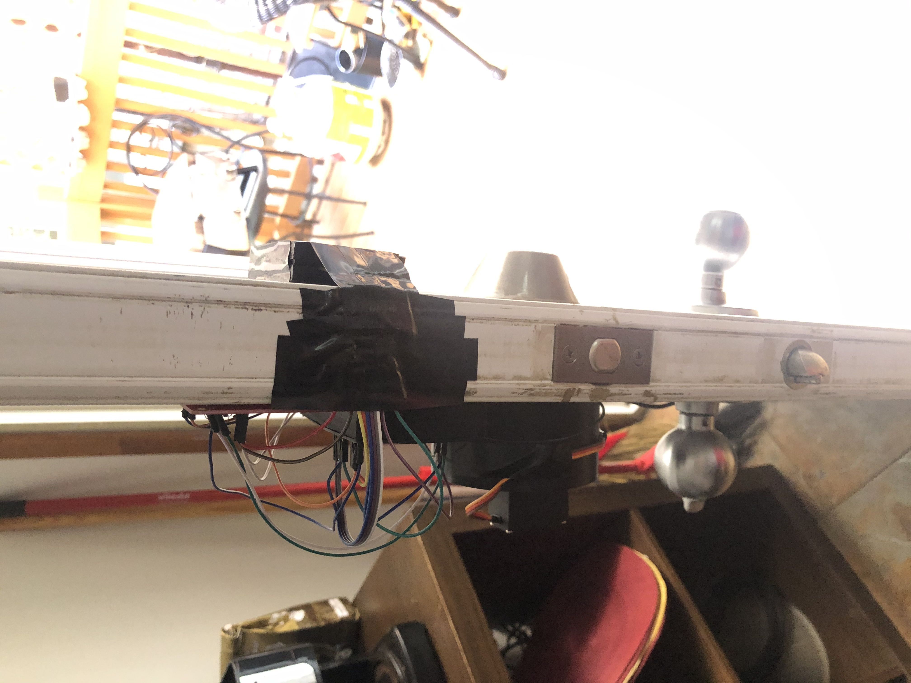
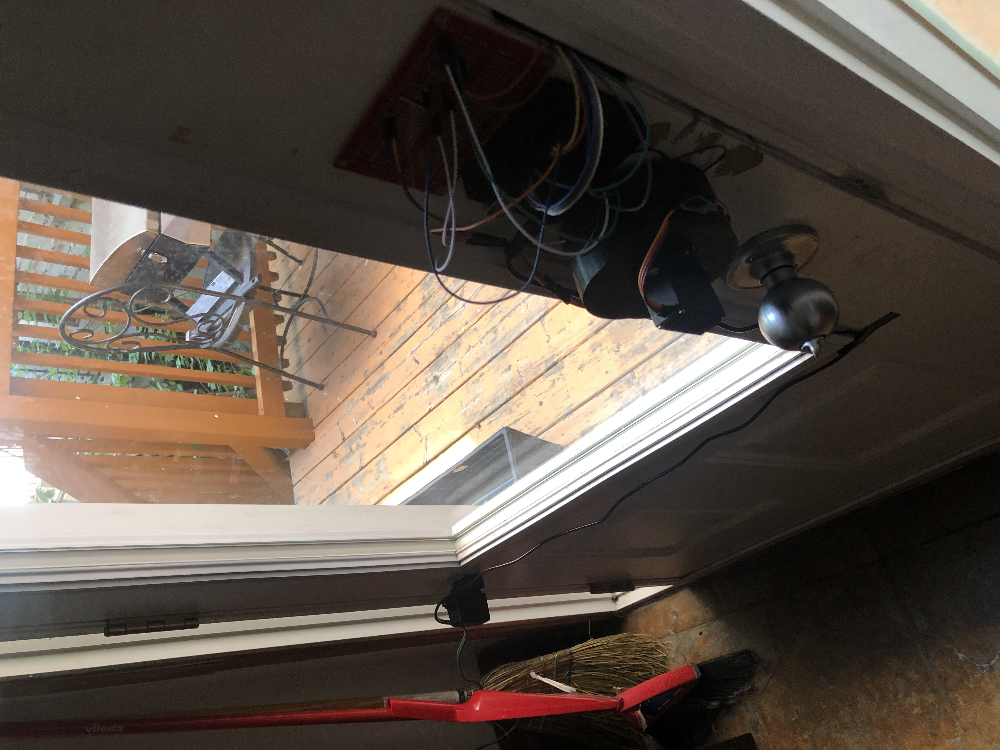

# Ardunio_locking_door_rfid

This project is Arduino project build to unlock and lock a typical locker door of a house. The microcontroller interact with a RFID component to unlock the door. There is also a button in the inside to lock and unlock the door manually and tow led (green and red) to indicate if rfid card or tag is autorize or not.

this github contains everything you need to build this project from scratch. this github includes: 

-   STL files for 3D print 
-   Arduino circuit
-   Arduino Code
-   components listing and accessories

## Components 
    - Arduino uno
    - RFID kit (RFID-RC522 IC Card reader sensor module with cards and tags)
    - Servo motor MG995
    - Solde-able breadboard
    - Jump wires (dozen)
    - LED (red and green)
    - button
    - resistors (x3)
    - Special tools : 3D printer, solder, hot glue

## Result 

In the media_files folder, there is two videos that show the utilisation of the Arduino with the RFID chip. 